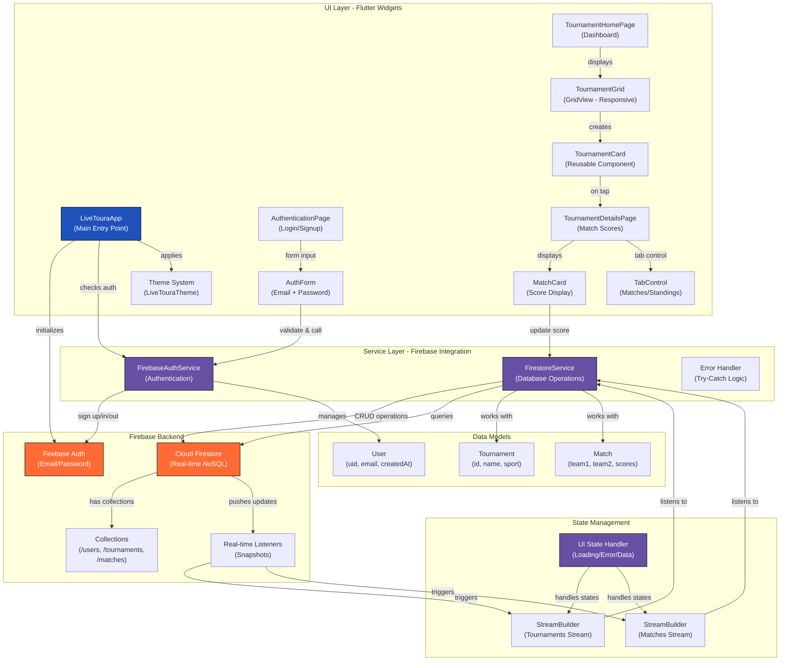
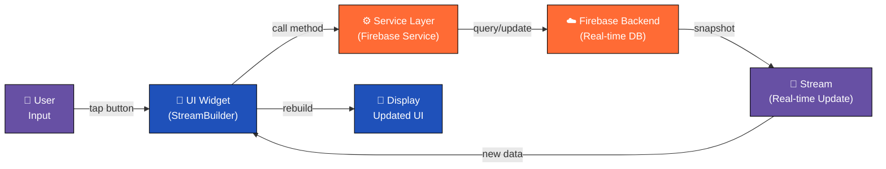
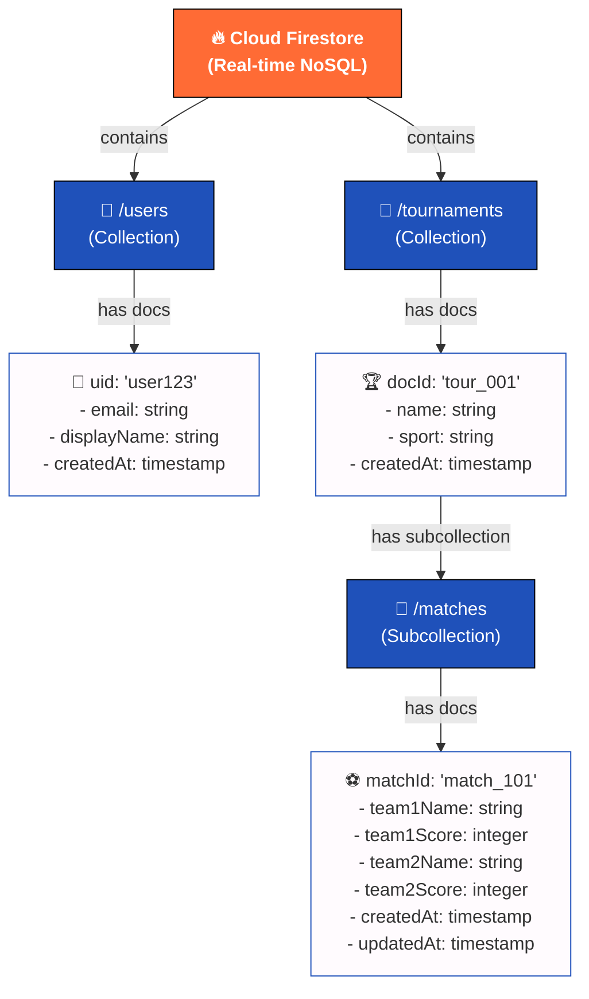
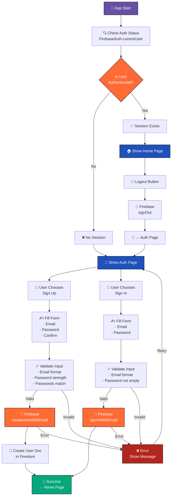
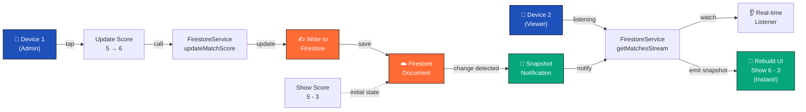
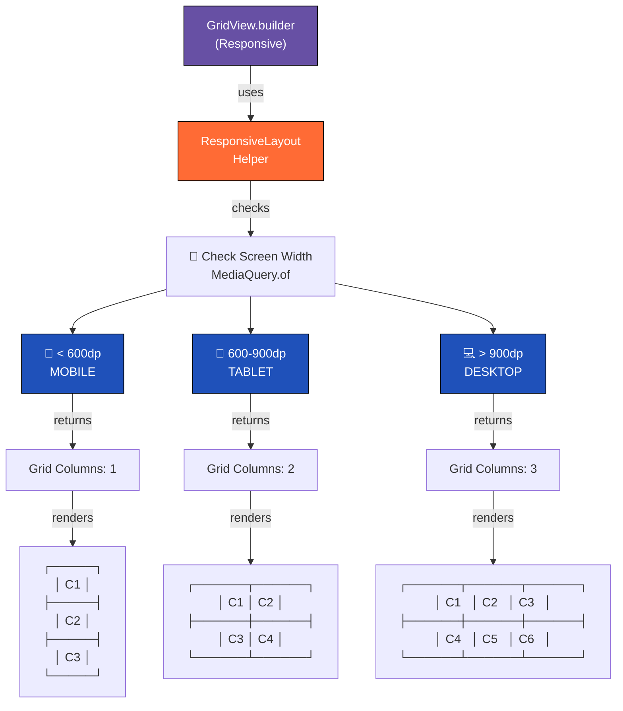
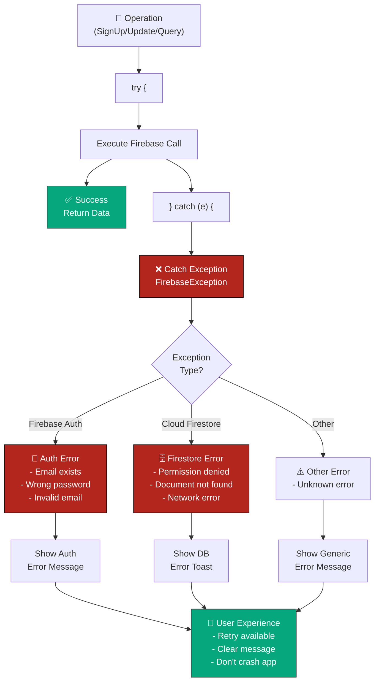
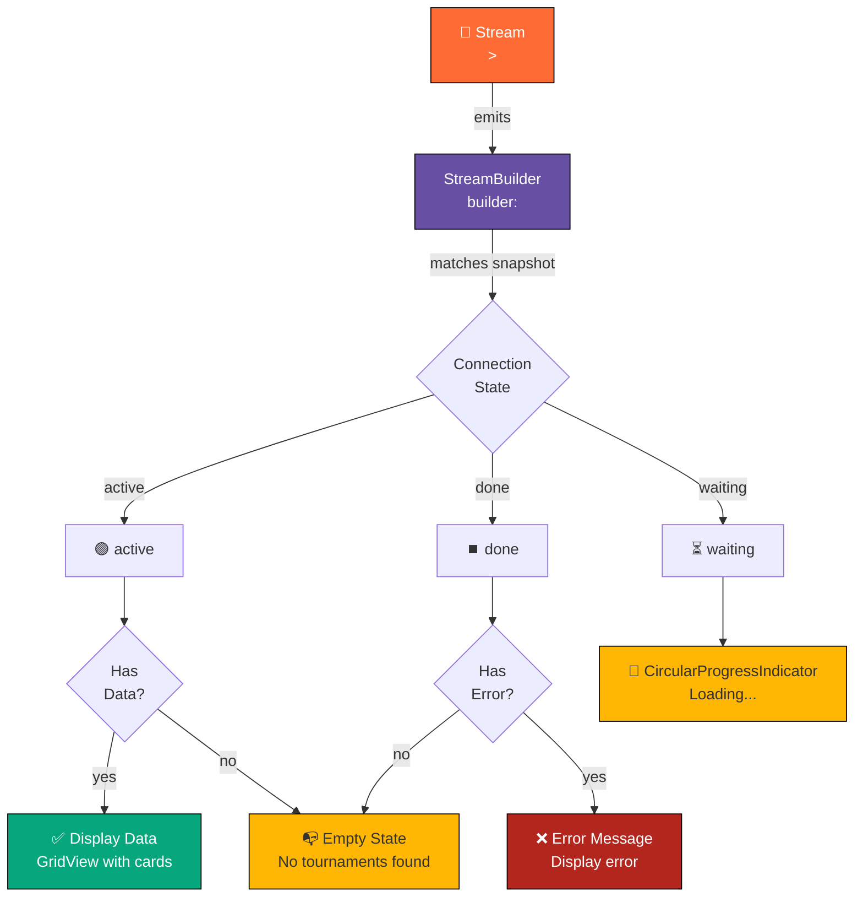
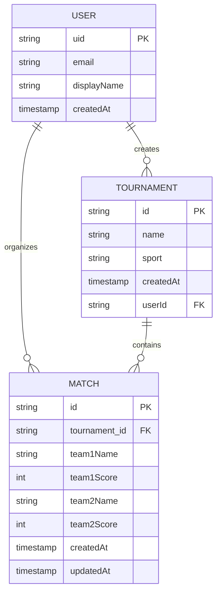
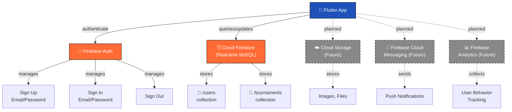

# LLD Visual Diagrams - LiveToura Flutter + Firebase

## 🎨 Complete Architecture Diagram



---

## 📊 Component Hierarchy Diagram

```mermaid
graph TD
    App["🎯 LiveTouraApp<br/>(Main Application)"]
    
    Auth["🔐 AuthenticationPage"]
    Login["📧 LoginForm<br/>- Email Input<br/>- Password Input<br/>- Login Button"]
    Signup["✍️ SignUpForm<br/>- Email Input<br/>- Password Input<br/>- Confirm Password<br/>- SignUp Button"]
    
    Home["🏠 TournamentHomePage<br/>(Dashboard)"]
    Grid["📋 GridView<br/>(Responsive: 1-3 cols)"]
    Card["🎖️ TournamentCard<br/>- Sport Badge<br/>- Tournament Name<br/>- Live Indicator<br/>- Join Button"]
    
    Details["📊 TournamentDetailsPage"]
    Tab["📑 TabBar"]
    Matches["⚽ Matches Tab<br/>- StreamBuilder<br/>- Match List"]
    Score["📈 MatchCard<br/>- Team 1 Name<br/>- Score Display<br/>- Team 2 Name<br/>- Update Buttons"]
    Standing["🏆 Standings Tab<br/>- Table View<br/>- Rankings"]
    
    App -->|authenticated| home: true
    App -->|not authenticated| Auth
    
    Auth -->|sign up| Signup
    Auth -->|sign in| Login
    
    Home -->|TAP CARD| Details
    Home -->|GRID DISPLAY| Grid
    Grid -->|REPEATED| Card
    
    Details -->|INIT| Tab
    Tab -->|MATCHES| Matches
    Tab -->|STANDINGS| Standing
    
    Matches -->|REPEATED| Score
    Score -->|TAP BUTTON| updateScore["Update Score<br/>in Firestore"]
    
    style App fill:#1F51BA,stroke:#000,color:#fff,font-weight:bold
    style Auth fill:#6750A4,stroke:#000,color:#fff
    style Home fill:#6750A4,stroke:#000,color:#fff
    style Details fill:#6750A4,stroke:#000,color:#fff
    style Grid fill:#FF6B35,stroke:#000,color:#fff
    style Card fill:#FFFBFE,stroke:#1F51BA,color:#000
    style Score fill:#FFFBFE,stroke:#1F51BA,color:#000
    style updateScore fill:#B3261E,stroke:#000,color:#fff
```

---

## 🔄 Data Flow Diagram



---

## 🗄️ Firestore Structure Diagram



---

## 🔐 Authentication Flow Diagram



---

## 📡 Real-Time Sync Flow Diagram



---

## 🏗️ Responsive Design Architecture



---

## ✅ Error Handling Flow



---

## 📋 State Management with StreamBuilder



---

## 🎯 Complete Data Model Relationships



---

## 🌐 Cloud Services Integration Map



---

**All diagrams above can be to take screenshots for your LLD submission!**

